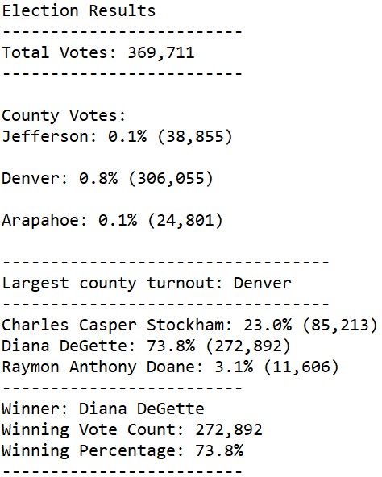

# Election Analysis

## Overview of Election Audit
For this challenge we were hired by an election ofice employee to automate the task of tallying votes in a given election. Writing the code in Python allows the program to be run on any election not just this specific one. For us, the purpose was to learn how to read and write to CSV files and manipulate the data within in order to acheive a desired result; all while using a real world example.

## Election Audit Results

The results of the election are as follows:
  - The total number of votes was 369,711
  - The number of votes in each county
        | Jefferson 38,855 (10.5%)
        | Denver: 306,055 (82.8%)
        | Arapahoe: 24,801  (6.7%)
  - The county with the largest number of votes was Denver
  - The breakdown of votes for each candidate
        | Stockham 23.0% (85,213)
        | DeGette 73.8% (272,892)
        | Doane 3.1% (11,606)
  - Dianna DeGette won the election with a percentage of 73.8% and a total vote count of 272,892

## Election-Audit Summary
This script could be used for any election by modifying the file_to_load variable and the file_to_save variable to fit the path of the election results csv file and the planned output text file. If this script is to be used at the state level then all instances of variables using the word "county" can be changed to "state" to accurately depict the results.
